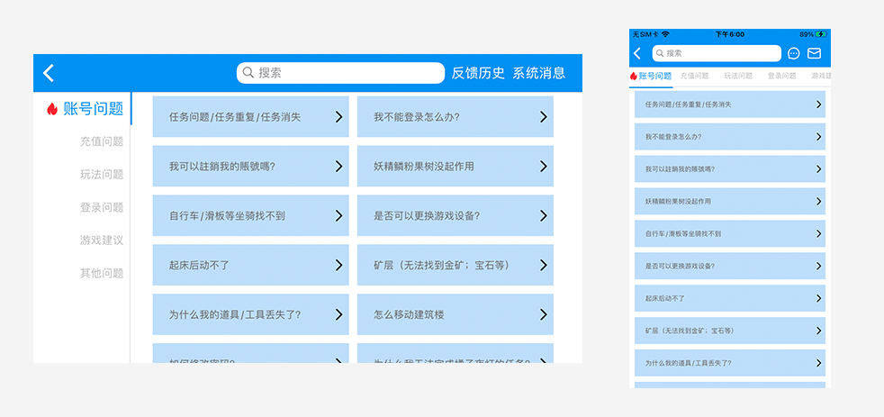

# 产品介绍

CSSDK-客服SDK，通过建立玩家与客服沟通的通道，帮助开发者快速收集用户反馈和建议；通过整理并提供常见问题列表，快速解决玩家遇到的问题与疑问。旨在提升用户游戏体验，实现数据驱动优化，助力游戏增长。本文档具体包括系统接入流程、CSSDK的技术嵌入指引、以及系统管理后台的功能操作说明。

示例：

# 快速开始

请选择适合您的平台快速开始吧

-  [iOS 帮助文档](/cssdk/ios/ios_start.md)
-  [Android 帮助文档](/cssdk/android/android_start.md)
-  [Unity 帮助文档](/cssdk/unity/unity_start.md)

