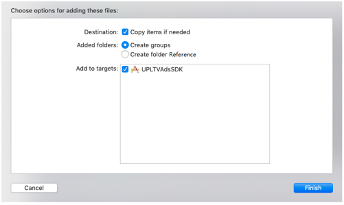

# 1 前提条件

- 确保您安装了最新的 Xcode12 或更高版本
- 确保您的项目定位到 iOS 10.0 或更高版本
- 确保您安装了CocoaPods

# 2 安装SDK

> [!note]
iOS Xcode建议使用CocoaPods进行接入

提供Cocoapods导入和手动导入，推荐使用Cocoapods方法导入SDK

## 2.1 使用Cocoapods引入(推荐)

### 2.1.1 安装CocoaPods

本文档默认开发者已安装CocoaPods，如需了解安装CocoaPods，请访问[此处](https://cocoapods.org/)


### 2.1.2 创建Podfile文件

在项目`.xcodeproj`文件的同级目录中，在终端使用如下命令，创建Podfile文件

```
touch Podfile
```

### 2.1.3 编写Podfile文件内容

我们为您提供了最新的Podfile，建议使用以下示例

```
source 'https://github.com/CocoaPods/Specs.git'
source 'https://github.com/Avid-ly/iOS-CocoaPods-Spec.git'

platform :ios, '10.0'

target 'CSSDKDemo' do

# CSSDK
pod 'CSSDK', '2.1.0.5'

end

```

其中`CSSDKDemo `替换为您Xcode项目的名字

!> 您还必须至少接入[TASDK](/tasdk/ios/ios_start.md)或[AASDK](/aasdk/ios/ios_start.md)。请参考相应的文档的Podfile文件。

### 2.1.4 下载安装SDK

在项目`.xcodeproj`文件的同级目录中，在终端使用如下命令

```
pod install
```

> [!note]
> 1 请注意查看安装完成之后Cocoapods是否有提示警告，如有请按照提示进行工程修改
> 
> 2 安装完成之后，应使用`.xcworkspace`打开项目，而不是`.xcodeproj`

此刻您已经完成了SDK的安装。请尝试编译，如果编译通过请进行下一步[项目设置](/cssdk/ios/ios_setting.md)。如果您编译不通过，请参考文档最后的常见编译问题解决


## 2.2 手动导入SDK

同时SDK也为您提供了手动接入的方式，方便您自行选择

> 前提条件：在接入CSSDK之前，导入 [TASDK](/tasdk/ios/ios_start.md) 和[AASDK](/aasdk/ios/ios_start.md)，TASDK和AASDK至少接入一个，否则CSSDK无法运行。</br>

1）从 [Github](https://github.com/Avid-ly/Avidly-CService-iOS-Demo/releases) 获取 SDK 包

**CServiceSDK**目录包含如下文件：

- CService.framework
- CService.bundle


2）添加 CServiceSDK

请同时将`CService.framework`与`CService.bundle`两个文件添加至`Xcode`工程目录下<br>;（需勾选 Xcode 弹框中的 “**Copy items if needed**” 和 “**Create groups**”）。如下图所示：</br>



3）添加第三方依赖库

在`TARGETS` > `General` > `Link Binary With Libraries`中添加依赖库:

- SystemConfiguration.framework
- Photos.framework


此刻您已经完成了SDK的安装。请尝试编译，如果编译通过请进行下一步[项目设置](/cssdk/ios/ios_setting.md)。如果您编译不通过，请参考文档最后的常见编译问题解决

</br>

# 3. 常见接入问题

如果接入完成之后编译不通过，可以查询[常见问题](/cssdk/ios/ios_faq.md)来解决


