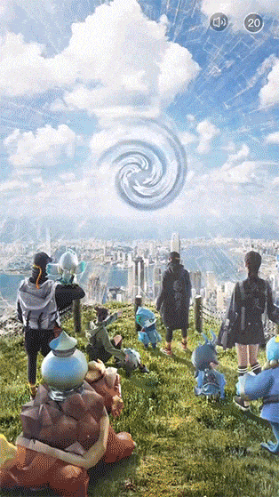

# 产品介绍

MSSDK 以提高游戏广告收益和游戏用户长期价值为努力方向。通过大数据和 AI 技术进行智能优化，帮助游戏开发者在稳定留存的前提下增加收益。

 

# 快速开始

请选择适合您的平台快速开始吧

-  [iOS 帮助文档](/mssdk/ios/ios_start.md)
-  [Android 帮助文档](/mssdk/android/android_start.md)
-  [Unity 帮助文档](/mssdk/unity/unity_start.md)

 

# 广告介绍

## 激励视频

所谓激励视频广告，指的是用户可以选择与之互动来换取应用内奖励的一种广告，激励广告是在赚取广告收入的同时保持用户参与您的应用程序的好方法。奖励通常以游戏内货币（金币、硬币、道具等）的形式出现，并在广告成功完成后分发给用户。本指南介绍了如何将 MSSDK 激励视频广告植入到 iOS 应用中

横屏状态下的激励视频示例：

竖屏状态下的激励视频示例：

 

## 插屏

插屏广告是全屏广告，它会覆盖整个应用界面，直到用户将其关闭。这些广告通常会在应用流程的自然过渡点（例如，活动之间或游戏关卡之间的暂停时段）展示。当应用展示插页式广告时，用户可以点按广告前往其目标页面，也可以关闭广告回到应用界面。

 

## 横幅广告

横幅广告会占据应用布局中的一处位置，要么是设备屏幕的顶部，要么是底部。这类广告会在用户与应用互动时停留在屏幕上，并且可在一段时间后自动刷新。

 
