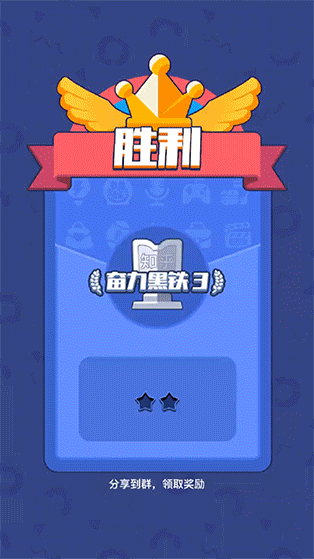

# 快速集成横幅广告

# 1 横幅广告介绍

横幅广告会占据应用布局中的一处位置，要么是设备屏幕的顶部，要么是底部。这类广告会在用户与应用互动时停留在屏幕上，并且可在一段时间后自动刷新。

<center>



</center>

<br>

# 2 应用场景
如果仅仅需要在视图顶部或底部构建长条横幅banner广告时，而且banner广告所依附的activity为当前游戏的activity，我们推荐参考以下方式，能更快更简洁地实现目标。针对这种情况，MSSDK进一步封装以下对象： ` com.ms.sdk.wrapper.banner.MsGameEasyBannerWrapper`


# 3 前提条件
- 确保您安装了Android Studio 3.2 或更高版本
- 确保您使用真实的Android设备，而不是模拟器进行开发和测试
- 确保您能访问诸如Facebook，Google等网址
- 按照步骤将 MSSDK 集成到您的项目中。
- 请务必在加载广告之前初始化 MSSDK


# 4 使用横幅广告

使用激励广告的主要步骤如下所示：

1. 初始化横幅广告
2. 注册回调
3. 展示广告
4. 隐藏/移除广告(可选)

## 4.1 初始化横幅广告

```java
 /**
* 必须优先正确调用此方法，完成game banner的初始化
* @param gameActivity 不能为空，当前banner广告所依附的activity
*/
public void initGameBannerWithActivity(Activity gameActivity);

```

## 4.2 注册回调
```java
/**
* 根据广告位，添加banner的回调代理
* @param cpPlaceId banner广告位，通常用来标注某种广告的业务类型
* @param callback banner的回调对象
*/
public void addBannerCallbackAtADPlaceId(String cpPlaceId, MsBannerAdListener callback)
```

## 4.3 展示广告

>以给banner加载提供必要的加载时间，请在初始化之后延迟一段时间进行展示
```java
/**
* 根据广告位，将banner展现到当前activity的顶部
* 请在actvity onresume之后调用此方法，避免异常：BadTokenException: Unable to add window -- token null is not valid;
* @param cpPlaceId banner广告位，通常用来标注某种广告的业务类型
*/
public void showTopBannerAtADPlaceId(String cpPlaceId);

/**
* 根据广告位，将banner展现到当前activity的底部
* 请在onresume之后调用此方法，避免异常：BadTokenException: Unable to add window -- token null is not valid;
* @param cpPlaceId banner广告位，通常用来标注某种广告的业务类型
*/
public void showBottomBannerAtADPlaceId(String cpPlaceId);

```

## 4.4 隐藏/移除广告(可选)


```java

/**
* 根据指定的广告位，移除某个banner广告，但不会删除相应的回调
* 如果此广告位不存在，不会引发任何实际的操作
* banner广告位一旦被移除，下次show的时候，会再次加载
* 如果仅仅是隐藏当前banner广告,请调用hideTopBanner()或hideBottomBanner()
* @param cpPlaceId banner广告位，通常用来标注某种广告的业务类型
*/
public void removeGameBannerAtADPlaceId(String cpPlaceId);
   
/**
* 隐藏当前顶部banner广告
* 无须区分广告位
* 再次展示时，需要调用需要调用showTopBannerAtADPlaceId()
*/
public void hideTopBanner();
	
/**
* 隐藏当前底部banner广告
* 无须区分广告位
* 再次展示时，需要调用showBottomBannerAtADPlaceId()
*/
public void hideBottomBanner();
	
```
   
	
## 5 使用示例

以下是在当前activity构建一个底部banner的快速方式。

```java
    protected void onCreate(Bundle savedInstanceState) {
    super.onCreate(savedInstanceState);
    setContentView(R.layout.activity_banner);
    // 初始化banner
    MsGameEasyBannerWrapper.getInstance().initGameBannerWithActivity(this);
    // 添加回调接口
    MsGameEasyBannerWrapper.getInstance().addBannerCallbackAtADPlaceId("banner_aaa", new MsBannerAdListener() {
        @Override
        public void onClicked() {
            Log.i(TAG, "banner_aaa onClicked ");
        }

        @Override
        public void onDisplayed() {
            Log.i(TAG, "banner_aaa onDisplayed ");
        }
    });
    // 延期0.2s后显示banner，demo仅仅保证在activity onresume之后调用showBottomBannerAtADPlaceId()
    (new Handler(Looper.getMainLooper())).postDelayed(new Runnable() {
        @Override
        public void run() {
            MsGameEasyBannerWrapper.getInstance().showBottomBannerAtADPlaceId("banner_aaa");
        }
    }, 200);
}

```

