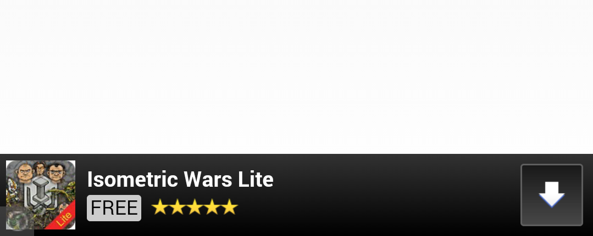

# 1 横幅广告介绍

横幅广告会占据应用布局中的一处位置，要么是设备屏幕的顶部，要么是底部。这类广告会在用户与应用互动时停留在屏幕上，并且可在一段时间后自动刷新。

<!---->


<br>

# 2 前提条件

在您的应用中集成激励广告之前，您必须：

- 按照我们的步骤将 MSSDK 集成到您的项目中。
- 请务必在加载广告之前初始化 MSSDK

<br>

# 3 使用横幅广告

使用激励广告的主要步骤如下所示：

1. 获取横幅广告
2. 注册回调
3. 加载广告
4. 处理广告事件

## 3.1 获取横幅广告

在要使用的类中引入头文件

```
#import <MSSDK/MSSDK.h>
```

和

```
#if __has_include(<MoPub/MoPub.h>)
    #import <MoPub/MoPub.h>
#elif __has_include(<MoPubSDKFramework/MoPub.h>)
    #import <MoPubSDKFramework/MoPub.h>
#else
    #import "MoPub.h"
#endif
```

之后声明全局的`MPAdView`对象，示例如下

```
@interface MSBannerDemoViewController () <MPAdViewDelegate>
{
    MPAdView *_bannerView;
}
```

获取横幅广告视图，示例如下

```
- (void)viewDidLoad {
	[super viewDidLoad];
	_bannerView = [MSSDK initBannerView];
}
```

设置横幅广告的大小，并加载在当前视图上

```
- (void)viewDidLoad {
	[super viewDidLoad];
	_bannerView = [MSSDK initBannerView];
	_bannerView.frame = CGRectMake(0, self.view.frame.size.height - 50, self.view.frame.size.width, 50);
[self.view addSubview:_bannerView];
}
```

## 3.2 注册回调

在要使用的类的interface中声明`MPAdViewDelegate`回调

```
@interface MSBannerDemoViewController () <MPAdViewDelegate>
@end
```

设施横幅广告代理

```
_bannerView.delegate = self;
```

## 3.3 加载横幅广告

```
- (void)viewDidLoad {
	[super viewDidLoad];
	_bannerView = [MSSDK initBannerView];
	_bannerView.frame = CGRectMake(0, self.view.frame.size.height - 50, self.view.frame.size.width, 50);
[self.view addSubview:_bannerView];
	[_bannerView loadAdWithMaxAdSize:kMPPresetMaxAdSizeMatchFrame];
}
```

!> 广告的加载必须在主线程中进行

## 3.4 处理广告事件

在刚才注册回调的类中声明以下方法：

以及实现代理方法

```
#pragma mark - MPBannerDelegate

// 获取展示的根视图
- (UIViewController *)viewControllerForPresentingModalView {
    return self;
}

// 加载成功
- (void)adViewDidLoadAd:(MPAdView *)view adSize:(CGSize)adSize {
    NSLog(@"Banner adViewDidLoadAd");
}

// 加载失败
- (void)adView:(MPAdView *)view didFailToLoadAdWithError:(NSError *)error {
    NSLog(@"Banner adView:didFailToLoadAdWithError");
}

// 用户点击横幅广告视图，将全屏展示广告
- (void)willPresentModalViewForAd:(MPAdView *)view {
    NSLog(@"Banner willPresentModalViewForAd");
}

// 用户关闭全屏广告视图
- (void)didDismissModalViewForAd:(MPAdView *)view {
    NSLog(@"Banner didDismissModalViewForAd");
}

// 点击广告离开当前app
- (void)willLeaveApplicationFromAd:(MPAdView *)view {
    NSLog(@"Banner willLeaveApplicationFromAd");
}
```

可根据对应的广告事件回调，来处理接下来的游戏逻辑；

其中广告事件的回调顺序为：

1. 获取展示的根视图
2. 加载成功 or 加载失败（由于广告会自定刷新，所以这两个回调会回调多次）
3. 用户点击横幅广告视图，展示全屏视图
4. 点击广告离开当前app（当用户或玩家点击全屏视图之后才会触发，如用户未点击则不触发）
5. 用户关闭全屏视图

到此，您已经成功将激励视频集成到您的游戏或App里，如有问题，请参考下边的常见问题

<br>

# 4 常见问题

- 何时关闭和恢复游戏背景音乐与逻辑
- 如何更新横幅广告
- 如何设置横幅广告的大小

> 何时关闭和恢复游戏背景音乐与逻辑

建议在调用`willPresentModalViewForAd`时关闭背景音乐，暂停游戏逻辑；在收到`didDismissModalViewForAd`回调时将控制器交换给游戏，恢复背景音乐，开始游戏逻辑。

> 如何更新横幅广告

横幅广告会一直显示在页面上，且会定时自动刷新，股不需要开发者主动进行刷新操作

> 如何设置合适的横幅广告的大小

建议横幅广告的宽度与设备宽度保持一直，横幅广告在横向会自动居中显示；横幅广告的高度，在iPhone上建议设置为50，在iPad上，建议设置为90。