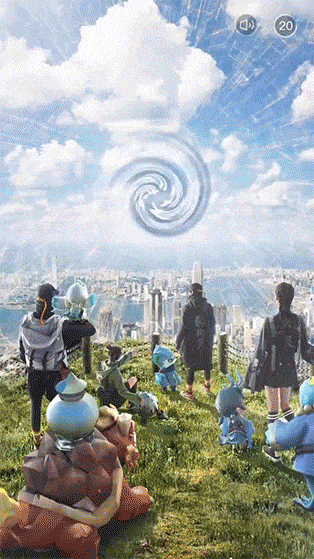

# 1 激励视频广告介绍

所谓激励视频广告，指的是用户可以选择与之互动来换取应用内奖励的一种广告，激励广告是在赚取广告收入的同时保持用户参与您的应用程序的好方法。奖励通常以游戏内货币（金币、硬币、道具等）的形式出现，并在广告成功完成后分发给用户。本指南介绍了如何将 MSSDK 激励视频广告植入到 iOS 应用中


横屏状态下的激励视频示例：

<center>


</center>

竖屏状态下的激励视频示例：

<center>



</center>

<br>

# 2 前提条件

在您的应用中集成激励广告之前，您必须：

- 按照我们的步骤将 MSSDK 集成到您的项目中。
- 请务必在加载广告之前初始化 MSSDK

<br>

# 3 使用激励视频广告

使用激励广告的主要步骤如下所示：

1. 注册回调
2. 判断广告是否填充
3. 展示广告
4. 处理广告事件

## 3.1 注册回调

在要使用的类中引入头文件

```
#import <MSSDK/MSSDK.h>
```

在要使用的类的interface中声明`MSRewardedVideoDelegate`回调

```
@interface MSRewardDemoViewController () <MSRewardedVideoDelegate>
@end
```

注册回调：

```
- (void)viewDidLoad {
	[super viewDidLoad];
	[MSSDK setRewardDelegate:self];
}
```

## 3.2 判断广告是否填充

MSSDK使用自动加载广告的模式，无需开发者持有广告对象、调用加载方法和记录广告加载结果，大大减少开发者的负担，使开发者能将精力聚焦游戏逻辑。

当需要展示广告时，只需判断当前广告有填充，即可展示广告。当无填充时，本次无法展示广告。所以必须先判断广告有填充才能展示广告

```
BOOL b = [MSSDK hasRewardAdAvailable];
if (b) {
	// 广告已填充，可以展示广告
}
```


## 3.3 展示广告

```
[MSSDK presentRewardVideoAdForAdUnitID:@"YourAdUnitID" fromViewController:self];
```

- 其中`YourAdUnitID` 替换为您的广告位，用于广告数据的区分
- 其中`self` 替换为您当前的视图控制器

!> 在播放之前需要完成代理的设置


## 3.4 处理广告事件

在刚才注册回调的类中声明以下方法：

```
#pragma mark - MSRewardedVideoDelegate

// 广告打开
- (void)MSRewardVideoAdDidOpen {
    NSLog(@"MSSDK MSRewardVideoAdDidOpen");
}

// 广告点击
- (void)MSRewardVideoAdDidCilck {
    NSLog(@"MSSDK MSRewardVideoAdDidCilck");
}

// 广告发放奖励
- (void)MSRewardVideoAdDidRewardUserWithReward {
    NSLog(@"MSSDK MSRewardVideoAdDidRewardUserWithReward");
}

// 广告关闭
- (void)MSRewardVideoAdDidClose {
    NSLog(@"MSSDK MSRewardVideoAdDidClose");
}
```

可根据对应的广告事件回调，来处理接下来的游戏逻辑；

其中广告事件的回调顺序为：

1. 广告打开
2. 广告点击（当用户或玩家点击广告之后才会触发，如用户未点击广告则不触发）
3. 广告发放奖励（当用户满足发放奖励条件的时候，会触发。如不满足发放奖励则不触发）
4. 广告关闭（当用户点击x关闭广告时触发，与广告发放奖励没有绝对的先后顺序）


到此，您已经成功将激励视频集成到您的游戏或App里，如有问题，请参考下边的常见问题

<br>

# 4 常见问题

- 何时关闭和恢复游戏背景音乐与逻辑
- 如何判断广告生命周期结束
- 如何获得广告加载成功的回调
- 如何判断是否给玩家发放奖励
- 能在广告关闭回调中直接展示广告吗
- 广告播放时能进行横竖屏切换吗

> <span id="reward_faq1">何时关闭和恢复游戏背景音乐与逻辑</span>

建议在调用`presentRewardVideoAdForAdUnitID`时关闭背景音乐，暂停游戏逻辑；在收到`MSRewardVideoAdDidClose`回调时恢复背景音乐，开始游戏逻辑。

> <span id="reward_faq2">如何判断广告生命周期结束</span>

当收到`MSRewardVideoAdDidClose`回调时，意味着本次广告展示结束

> <span id="reward_faq3">如何获得广告加载成功的回调</span>

MSSDK使用自动加载广告的模式，无需开发者持有广告对象、调用加载方法和记录广告加载结果，大大减少开发者的负担，使开发者能将精力聚焦游戏逻辑。如您想获得广告加载成功的回调，可自行定时监控循环`hasRewardAdAvailable`方法即可，循环间隔由您自行控制，建议不要太短，5s以上为宜。

> <span id="reward_faq4">如何判断是否给玩家发放奖励</span>

当收到`MSRewardVideoAdDidRewardUserWithReward`回调时说明玩家或用户已满足发放奖励回调，则可以给玩家发放奖励。如未触发此回调，说明未满足发放奖励的条件。

> <span id="reward_faq5">能在广告关闭回调中直接展示广告吗</span>

不建议这样做。因为有些平台如admob，需要一定的时间间隔来渲染下一个广告。在广告关闭回调中立刻播放admob的广告会造成广告无法正常展示的情况。

> <span id="reward_faq6">广告播放时能进行横竖屏切换吗</span>

不建议这样做。有些平台在横屏状态下加载的横屏素材是无法在竖屏状态下展示的，可能会造成无法展示或者游戏闪退等不可控现象。