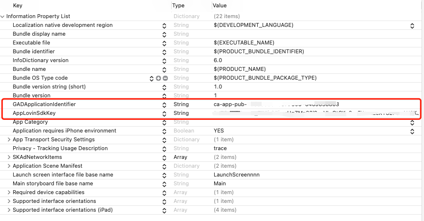

为了使 MSSDK 集成到您的应用程序之后能够正常使用，必须执行几个快速步骤：

# 1 配置应用传输安全 (ATS)

随着 iOS 9 的发布，Apple 引入了 ATS，它要求应用程序通过 SSL 建立安全的网络连接，并通过其对 SSL 版本、加密密码和密钥长度的要求强制执行 HTTPS 连接。目前，MSSDK 强烈建议在您的应用程序中禁用 ATS。请注意，虽然 MSSDK 完全支持 HTTPS，但我们的一些广告商和第三方广告商可能不支持。因此启用 ATS 可能会导致填充率降低。

为了防止您的广告（和您的收入）受到 ATS 的影响，请通过将以下内容添加到您的 info.plist 来禁用它：

```
<key>NSAppTransportSecurity</key>
<dict>
    <key>NSAllowsArbitraryLoads</key>
    <true/>
</dict>
```

<br>

# 2 配置隐私控制（可选）

在 iOS 10 中，Apple 通过限制对相机、照片库等功能的访问来扩展其隐私控制的范围。为了在利用这些服务的 SDK 中解锁丰富的沉浸式体验，请添加以下条目到您的应用程序列表：

```
<key>NSPhotoLibraryUsageDescription</key>
<string>Some ad content may require access to the photo library.</string>
<key>NSCameraUsageDescription</key>
<string>Some ad content may access camera to take picture.</string>
<key>NSMotionUsageDescription</key>
<string>Some ad content may require access to accelerometer for interactive ad experience.</string>
```

<br>

# 3 配置AdNetworks

随着 iOS 11.3 的发布，Apple 引入了一种新的安装归因处理方式SKAdNetwork。让广告平台在不获取 IDFA 的前提下追踪用户的点击和安装行为，衡量广告的转化成效。开发者需要将每个广告平台的 SKAdNetworkIdentifier 配置在游戏的 `Info.plist` 文件中。

## 3.1 SKAdNetworkIdentifier 介绍

SKAdNetworkIdentifier工具支持平台众多，添加快捷方便，能够获取各平台最新的 SKAdNetworkIdentifier，去重后写入项目的 `Info.plist` 中。

## 3.2 下载和安装

需要提前安装Homebrew，然后在终端中运行以下代码

```
brew install guojunliu/stskadnetwork/stskadnetwork
```

## 3.3 使用

```
usage: stskadnetwork [-p] [-x <path>] [-t <path>]

    -p, --plist                      将SKAdNetworkId导出到当前路径下的Info.plist

    -x, --xml                        将SKAdNetworkId以XML格式导出到当前路径
    -t, --txt                        将SKAdNetworkId以TXT格式导出到当前路径
```
两种用法，建议使用第一种

**用法一**：直接写入项目Info.plist
cd到项目`Info.plist`同级目录

- `stskadnetwork -p`

**用法二**：导出去重合并之后的SKAdNetworkIdentifier
YourPath为文件导出的目的目录
- `stskadnetwork -x YourPath`
- `stskadnetwork -t YourPath`
<br>

## 3.4 支持
当前支持的广告平台：

| 广告平台 | iOS 14 兼容版本 | 参考文档 |
| ------------ | ------------ | ------------ |
| Facebook | 6.2.1 + | https://developers.facebook.com/docs/audience-network/guides/SKAdNetwork |
|Admob | 7.64.0 + | https://developers.google.com/admob/ios/ios14 |
| Unity Ads | 3.5.1 + | https://unityads.unity3d.com/help/ios/skadnetwork-ids |
| Vungle | 6.9.1 + | https://support.vungle.com/hc/en-us/articles/360002925791-Integrate-Vungle-SDK-for-iOS#step-1-add-the-vungle-framework-to-your-xcode-project-0-4 |
| IronSource | 7.1.0 + | https://developers.ironsrc.com/ironsource-mobile/ios/ios-14-network-support/ |
| Applovin | 6.15.1 + | https://dash.applovin.com/documentation/mediation/ios/getting-started/skadnetwork-info |
| Chartboost | 8.3.1 + | https://answers.chartboost.com/en-us/child_article/ios-14 |
| Adcolony | 4.4.0 + | https://support.adcolony.com/helpdesk/network-ids-for-skadnetwork-ios-only/ |
| InMobi | 9.1.0 + | https://support.inmobi.com/monetize/ios-guidelines/preparing-for-ios-14 |
| Pangle | 3.4.1.1 + | https://www.pangle.cn/union/media/union/download/detail?id=23&docId=5f4f56cda7af9a000e5f4e24&osType=ios |
| MoPub | 5.16.0 + | https://developers.mopub.com/publishers/ios/integrate/#step-4-optionally-configure-tracking-permission-alert-using-att-framework-for-ios-14 |
| Mintegral | 6.6.0 + | https://dev.mintegral.com/doc/index.html?file=sdk-m_sdk-ios&lang=cn |

<br>

# 4 启用Facebook广告追踪功能

从 iOS 14 开始，您将需要设置 setAdvertiserTrackingEnabled 标记。通过此设置，您可根据自身需履行法定义务、平台条款和您对用户的承诺，通知 Audience Network 是否使用数据来投放个性化广告。如果标记设置为 false，我们将无法投放个性化广告。[Facebook参考文档](https://developers.facebook.com/docs/audience-network/setting-up/platform-setup/ios/advertising-tracking-enabled)

- 不论是否使用中介，您都需要实现 setAdvertiserTrackingEnabled 标记。
- 如果您正在集成 Facebook SDK 和 Audience Network SDK，则您还必须为 Facebook SDK 设置 setAdvertiserTrackingEnabled 标志。有关详细信息，请参阅启用广告主追踪功能。
- AdvertiserTrackingEnabled 仅适用于 iOS 14 及以上版本。对于 iOS 13 或更早版本，应使用“限制广告追踪”功能。
- 将 AdvertiserTrackingEnabled 标记设置为 true 或 false。在 Apple 强制执行提示的 iOS 版本中，如果您没有设置 ATE 标记，则此标记默认为 false。
- 此标记会自动合并到每个广告请求或竞价口令中。您无需额外调用 initilize() 方法。
- true 或 false 设置将保持为您选定的值，直到您手动对其进行更改为止。但是，如果用户卸载并重新安装您的应用，则您必须再次设置此标记。


## 4.1 设置“启用广告追踪”标记


调用 FBAdSettings 类的 setAdvertiserTrackingEnabled 方法，并将其设为 YES（针对 Objective-C）或 true（针对 Swift）。相反，若使用 Objective-C，则将 setAdvertiserTrackingEnabled 设为 NO；若使用 Swift，则设为 false。

如在使用中介，则需在初始化中介 SDK 之前实现 setAdvertiserTrackingEnabled 标记，以便我们在竞价请求中接收此标记。


以下是示例代码

```
// 在需要使用的地方引入以下头文件
#import <FBAudienceNetwork/FBAudienceNetwork.h>
#import <AppTrackingTransparency/AppTrackingTransparency.h>

// 当您获知<设备是否开启追踪>时，请调用以下方法
if (@available(iOS 14, *)) {
	ATTrackingManagerAuthorizationStatus trackingAuthorizationStatus = [ATTrackingManager trackingAuthorizationStatus];
	BOOL enabled = (trackingAuthorizationStatus==ATTrackingManagerAuthorizationStatusAuthorized)?YES:NO;
	[FBAdSettings setAdvertiserTrackingEnabled:enabled];
}
```


<br>

# 5 设置Admob、Applovin 联盟key

Admob和Applovin需要在info.plist文件中添加对应的key，才能正常使用

在Info.plist中配置对应的key。对应的value请联系相关人员获取

- GADApplicationIdentifier
- AppLovinSdkKey



!> 如果不设置，会导致广告无法填充和项目闪退等不可控情况。

恭喜您，到此已经完成了所有的项目设置，接下来您可以下一个步骤，SDK[初始化](/mssdk/ios/ios_init)了