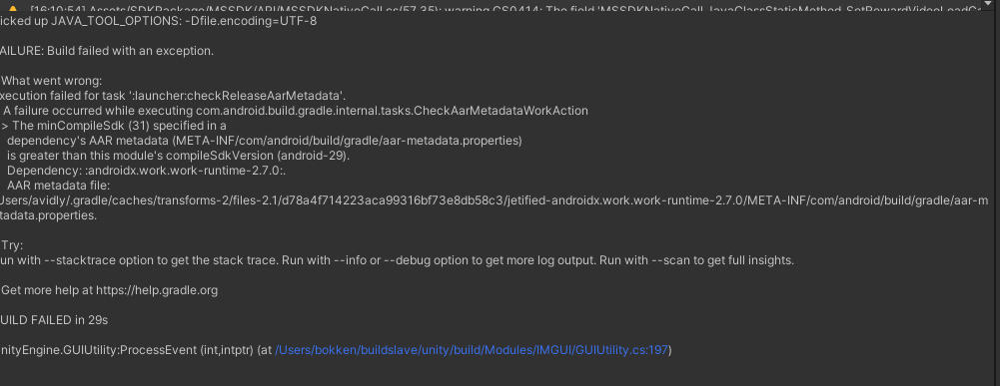
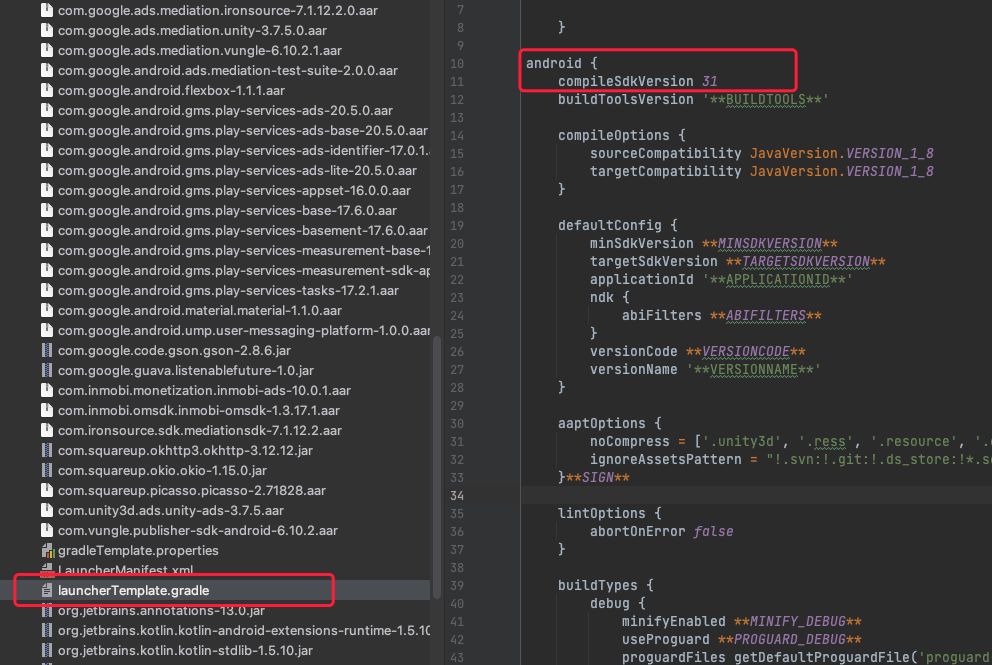
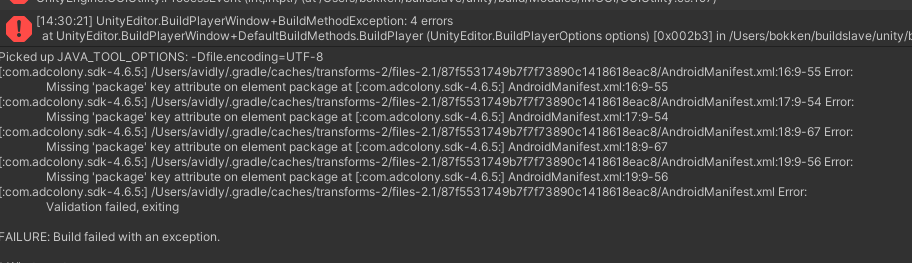
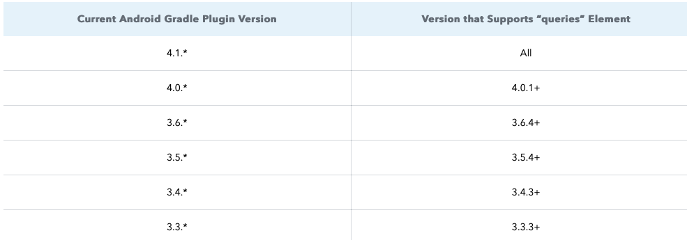
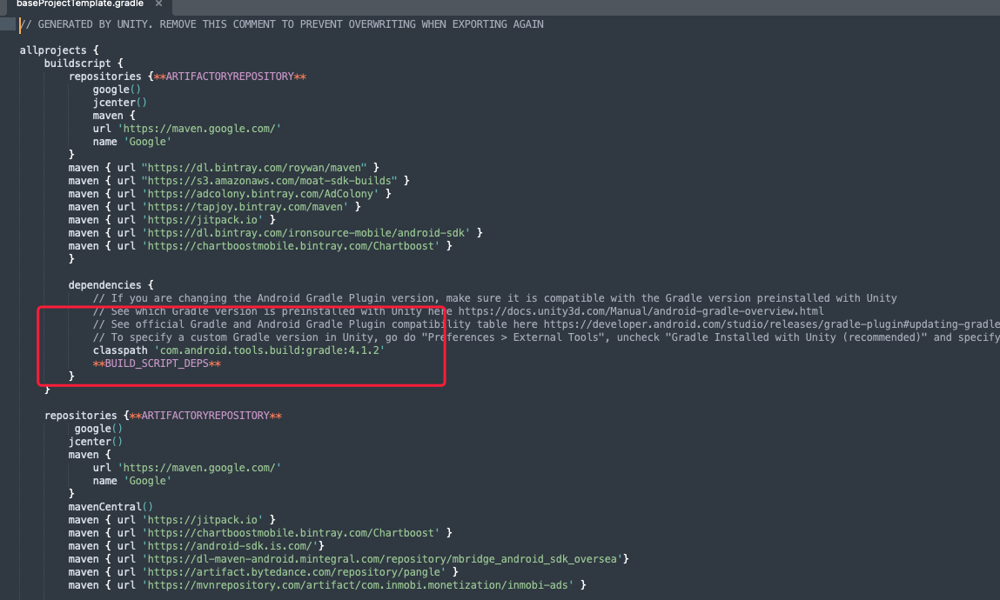

---
# 1. 前提条件
- Android 平台
- [下载](https://github.com/Avid-ly/Avidly-iOS-MSSDK-UnityPackage "下载") 最新的mssdk unity plugin
- 使用 Androidx，需 gradle插件版本 3.2.0+
- 已添加Unity Plugin

# 2. 目录结构
成功导入 Unity 插件 Android 版本后，检查 `Assets` 目录项下是否存在 `SDKPackage`- `MSSDK` 。


---
# 3. 下载依赖


&ensp;&ensp;1）检查导入的unityPackage
- Assets/目录下是否存在`ExternalDependencyManager` 文件夹
- Assets/目录下是否存在 `MSSDKDependencies.xml`依赖配置文件

&ensp;&ensp;2）下载依赖文件
右键Assets目录，选择External Dependency Manager - Android Resolver - Force Resolve, 下载依赖的jar包


# 4. 兼容 Admob 和 Applovin
## 4.1 &ensp;兼容Admob
根据 Admob 政策要求，需将产品在 Admob 的唯一性标识写在客户端中，而不能从服务端动态获取。

1）检查`LauncherManifest.xml`文件中是否包含`APPLICATION_ID`。

    <meta-data
    android:name="com.google.android.gms.ads.APPLICATION_ID"
    android:value="ca-app-pub-****************~**********" />

## 4.2&ensp;兼容Applovin
1）检查`LauncherManifest.xml`文件中是否包含`applovin.sdk.key`。

    <meta-data
    android:name="applovin.sdk.key"
    android:value="**************************" 
    />

---
# 5. 修改 Proguard

&ensp;&ensp;&ensp;如项目开启混淆功能，请将 `proguard-project.txt` 文件的内容复制粘贴至当前项目使用的混淆配置文件中，避免程序出现崩溃异常（因混淆导致包名引用错误）。

---
# 6. Demo
&ensp;&ensp;&ensp;有关广告 `MSSDK` 的接入及使用，可查看 [Demo工程](https://github.com/wawo00/Mssdk_Unity_Demo.git)。

恭喜您，到此已经完成了所有的项目设置，接下来您可以下一个步骤，SDK[初始化](/mssdk/unity/unity_init)了,遇到编译或其他问题可以参考以下常见问题

---
# <span id="mssdk-unitybianyi-faq">7. 常见问题</span>
## <span id="mssdk_unity_faq1">7.1 方法数超过 64K</span>
如因接入 MSSDK 导致方法数超过 65535，无法正常打包，请参考以下文档解决。</br>
[为方法数超过 64K 的应用启用 MultiDex](https://developer.android.com/studio/build/multidex?hl=zh-cn)

## <span id="mssdk_unity_faq2">7.2 The minComplieSdk (31) specified in a dependency's AAR.......jetified-androidx.work.work-runtime-2.7.0...</span>
出现下图所示编译问题时，需要指定编译版本为API 31


</br>
在gradle文件的android标签下指定编译版本




## <span id="mssdk_unity_faq3">7.3 Missing 'package' key attribute on element package at ...</span>
gradle编译找不到package或 <queries>标签报错，

```Java
Missing 'package' key attribute on element package at [:com.my.target.mytarget-sdk-5.11.3:]
AndroidManifest Validation failed
```

```Java
com.android.builder.internal.aapt.v2.Aapt2Exception: Android resource linking failed
error: unexpected element <queries> found in <manifest>.
```


</br>



**需要升级baseProjectTemplate.gradle 中的对应的gradle插件版本来支持新的标签类型**






