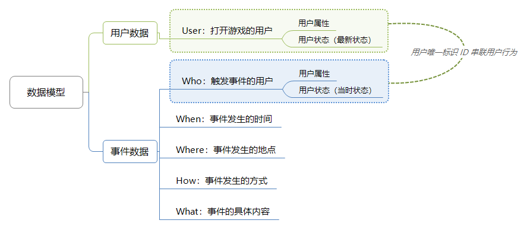

# 产品介绍

TASDK 事件统计SDK，主要用于统计用户在游戏中产生的行为事件，采集用户产生各种事件的时间、事件的类型以及事件的详细信息。TASDK体积小，集成简单，帮助开发者实现用户游戏事件数据的采集、建模和存储，为游戏数据分析提供可靠的数据来源，进而分析用户行为，建立用户画像，优化提升用户游戏体验，实现数据驱动优化，助力游戏增长。

 

# 快速开始

请选择适合您的平台快速开始吧

-  [iOS 帮助文档](/tasdk/ios/ios_start.md)
-  [Android 帮助文档](/tasdk/android/android_start.md)
-  [Unity 帮助文档](/tasdk/unity/unity_start.md)
-  [JavaScript 帮助文档](/tasdk/js/js_start.md)

 

# 数据模型

TASDK采用User-Event数据模型，将用户行为拆解为用户和事件，分别存入用户表和事件表中。
 

 

**用户数据**

用户数据是对用户最新状态和固定属性的描述。TASDK支持用户-角色的两层账号体系。在用户未登录时SDK会自动生成一个匿名用户标识，当用户真实登录后，匿名用户的数据会自动合并到登录账户，避免数据丢失，并与Appsflyer数据打通对齐，将用户行为数据完整的串联起来。
 

**事件数据**

事件数据描述的是行为事件相关的具体信息，通常概括为Who,When,Where,How,What五个元素，但不同的事件所描述的信息内容也会有所不同。TASDK已预置注册、登录、付费等事件统计，如果没有特殊的分析需求，推荐直接使用对应事件的统计接口上报数据；针对特殊需求，TASDK支持自定义统计，采用自定义统计方案时，为保证上报数据正常解析入库，请务必先与我们进行沟通确认。

# 预置事件

针对通用的游戏基础事件，TASDK提供了预置统计和事件属性的统计模板和上报接口，帮助开发者构造了完整的统计事件和事件属性参数模板，还可以获取到更加详细的数据报表和分析模型。TASDK预置的事件统计包括：

- 登录事件
- 时长统计
- 付费统计
- 游戏内事件统计
  

# 接入流程

1. 申请产品ID和渠道ID
2. 确认数据统计方案
3. 集成客户端SDK
4. 统计上报的测试
  
