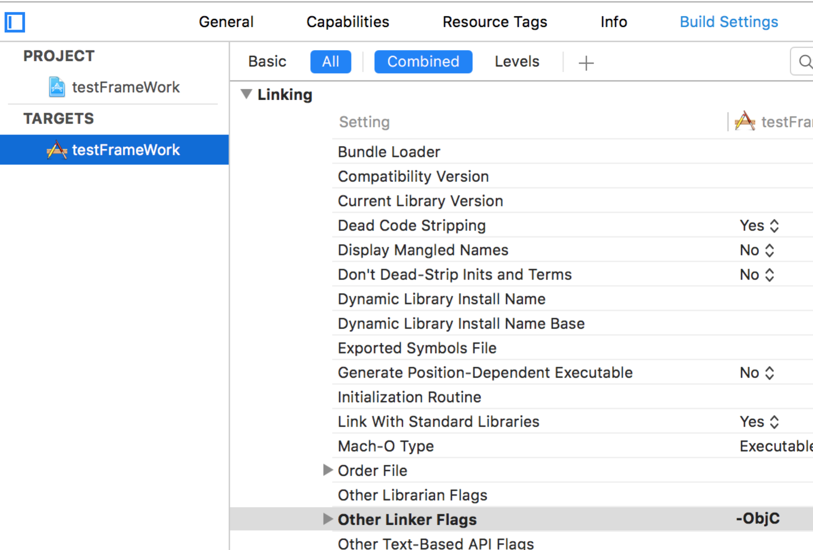
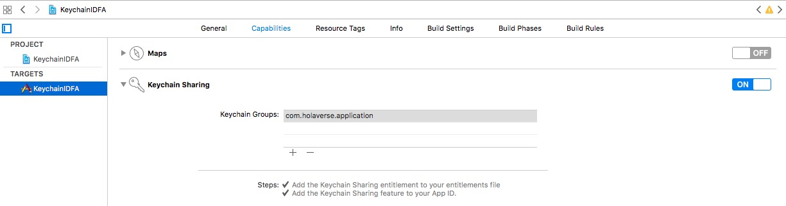

为了使 SDK 集成到您的应用程序之后能够正常使用，必须执行几个快速步骤：

# 1 配置应用传输安全 (ATS)

随着 iOS 9 的发布，Apple 引入了 ATS，它要求应用程序通过 SSL 建立安全的网络连接，并通过其对 SSL 版本、加密密码和密钥长度的要求强制执行 HTTPS 连接。目前，强烈建议在您的应用程序中禁用 ATS。请注意，虽然 AASDK 完全支持 HTTPS，但我们的一些第三方SDK可能不支持。因此启用 ATS 可能会导致一些问题。

为了防止您的广告（和您的收入）受到 ATS 的影响，请通过将以下内容添加到您的 info.plist 来禁用它：

```
<key>NSAppTransportSecurity</key>
<dict>
    <key>NSAllowsArbitraryLoads</key>
    <true/>
</dict>
```

# 2 配置链接器标志

Objective-C语言中类别，Unix的标准静态库实现和Objective-C的动态特性之间有一些冲突：OC没有为每个函数（或者方法）定义链接符号，它只为每个类创建链接符号。这样当在一个静态库中使用类别来扩展已有类的时候，链接器不知道如何把类原有的方法和类别中的方法整合起来，就会导致你调用类别中的方法时，出现错误。为了解决这个问题，引入了-ObjC标志，它的作用就是将静态库中所有的和对象相关的文件都加载进来。

在 TARGETS > Build Setting > Linking > Other Linker Flags 中添加 `-ObjC`：



<br>

# 3 开启钥匙串功能

开启 Keychain Sharing：




恭喜您，到此已经完成了所有的项目设置，接下来您可以下一个步骤，SDK[初始化](/tasdk/ios/ios_init)了


