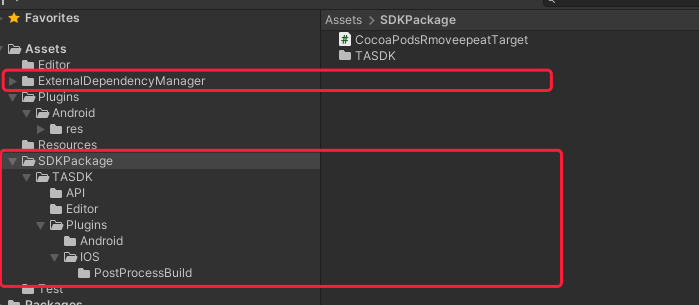

# 1. 前提条件
- 使用Unity5及以上引擎

# 2. 导入 SDK 包
## 2.1 导入SDK
如首次使用统计 SDK 包，请直接将 **TASDK_Unity-xxxx.unitypackage**导入至当前工程的`Assets`目录中，导入后目录为**SDKPackage**。SDK 同时会导入EDM插件 如图所示：

## 2.2 升级 SDK 包
更新SDK UnityPackage时，请先删除旧版本的SDK文件夹**PolyTrace**或**SDKPackage**，再导入新的SDK

# 3. 常见问题
