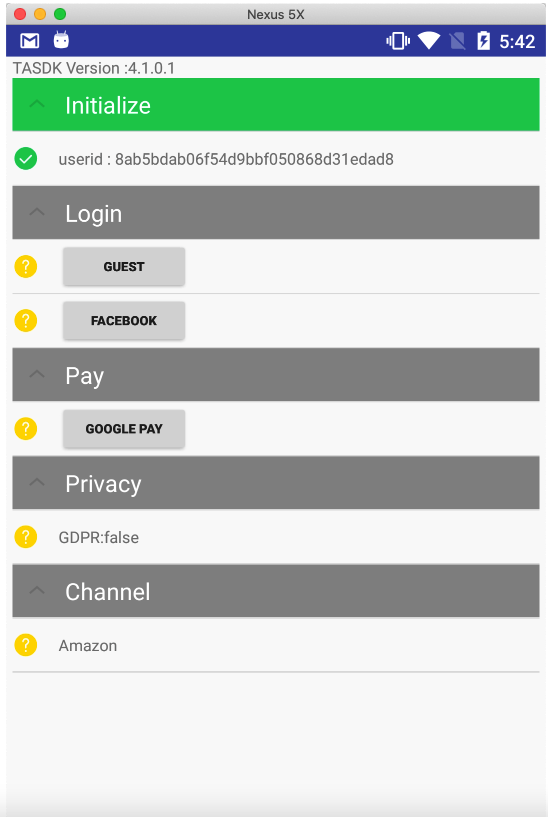
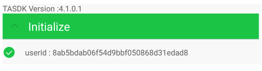
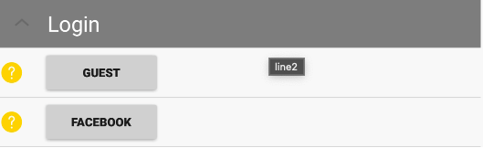
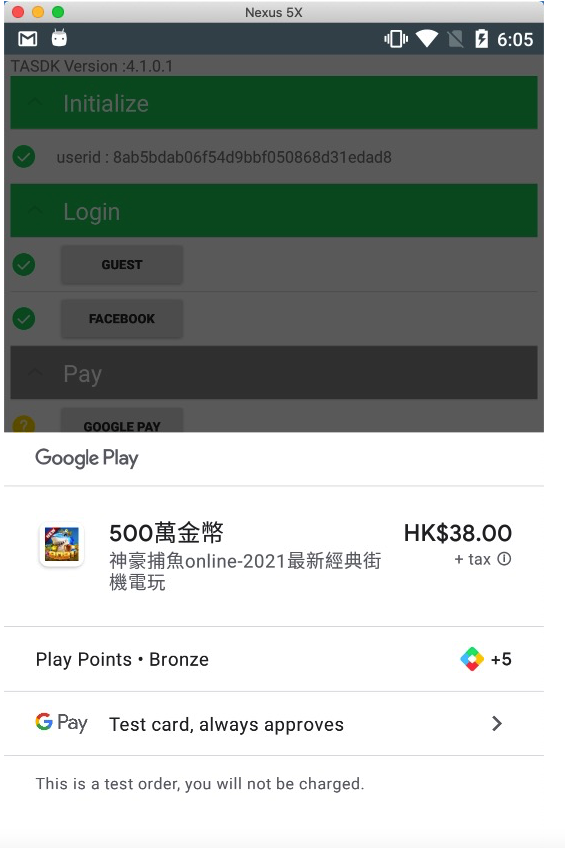
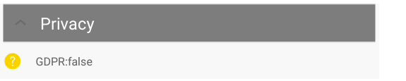
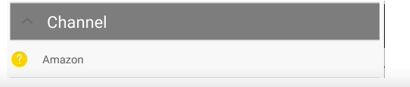

# 1.TASDK测试套件-TASDK Helper (Unity-Android)

通过统计包功能测试套件(TASDK Helper)，您可以测试是否正确配置了TASDK，使其能够通过上报和打点完成游戏的数据收集。本指南简要介绍了如何将功能测试套件集成到您的应用中，以在应用中使用此工具。

</br>

# 2.前提条件

- TASDK-Unity-  4.1.0.1 或更高版本。
- 导入了External Dependency Manager插件用于下载依赖包

- Google Play 服务 9.8.0 或更高版本。

- 确保您的谷歌账号在测试白名单中
- 仅适用Unity-Android
  


# 3.使用测试套件

## 3.1 引用TASDK Helper
将以下依赖添加到SDKPackage-TASDK-Editor-TASDKDependencies 文件中的```<androidPackages>```标签下:

```xml
   <androidPackage spec="com.aly.sdk.ext:tasdkhelper:1.0.0.1" >
       <repository>https://mvn-bx.dataverse.cn/repository/maven-releases/</repository>
  </androidPackage>
  <androidPackage spec="com.android.support:appcompat-v7:27.1.1" />
```

## 3.2 下载依赖的jar包
在Unity project中的Assets目录上右键，选择External Dependency Manager - Android Resolver - Force Resolve, 下载依赖的jar包

## 3.3 启动TASDK Helper

使用下面这行代码启动测试套件：

 ```C#
UPTraceApi.showHelper(PRODUCTID, CHANNELID);
```


# 4.测试套件导航



## 4.1 Initialize-TASDK初始化检查

图中 **TASDK Version** 后面的数字便是当前SDK的版本号,绿色表示tasdk初始化成功，点击显示当前用户的userId



## 4.2 Login-登录上报检查
登录上报相关，包括游客登录和fb登录，点击之后loading进行上报，绿色表示通过,如果您游戏不包含facebook的登录，将不会显示facebook登录按钮

 

## 4.3 Pay-支付上报检查
支付的测试，点击显示输入框，输入框中输入商品id,支付成功，绿色表示通过
> 目前只支持GP市场的google pay测试



## 4.4 Privacy-隐私授权检查
对应的是方法 disableAccessPrivacyInformation() 的调用情况，如果调用了会显示true
```groovy
void disableAccessPrivacyInformation();
```
 


## 4.5 Channel-发行检查
- 如果您的发行渠道是Google play，会在channel下显示**Google Play**，可以无视下方代码。

- 如果您的发行渠道是Amazon，并在manifest文件中添加了有名为channel的标签,会显示如图的内容 **Amzon** 

```groovy
  < meta-data android:name="CHANNEL" android:value="Amazon"/ >
```
 
