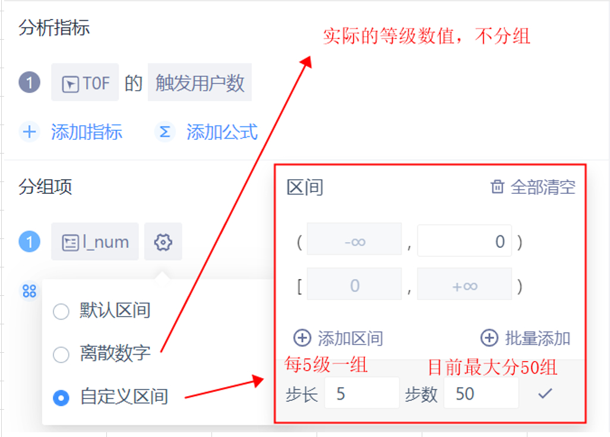

# 操作类问题

## **1.Q:为什么有的事件参数只有一个选择而有的可以计算均值等指标？**
**A**:图一的l参数是非数值型，只支持去重;图二的l_num参数是数值，因此可以进行求和、均值等各类运算。

*更新于2021-07-15*

## **2.Q:如何自定义分组项的分组？**
**A**:以l_num参数(必须确认其为数值型)为例，点击设定-自定义区间，此处可批量设定最大50组的分组，
每组中包含上边界，不包含下边界，设定完成后注意点击“√"保存再计算查看结果。

*更新于2021-07-15*

## **3.Q:为什么分组项中找不到某些事件属性？**
**A**:首先，“分组项”的设置是对分析对象中所有事件进行分组，图一中有两个分析对象，且只有T09事件才有g_num属性，因此g_num不能作为对所有事件的分组项；其次，若只需将T09事件按g_num分组，在事件分析中，在分组项右侧可选择设置“事件拆分”，“事件拆分”解决只需对分析对象中某一事件进行分组统计的需求。如图二，添加“事件拆分”后，T09的d_num人均值会根据g_num进行分组，token_sum的触发用户数无法根据g_num分组，会显示在总体组别中。

*更新于2021-11-15*

 

## **4.Q:为什么有些属性作为分组项，无法设定分组方式？**
**A**:对于数值型、时间型、列表型属性，在作为分组项时才可以设定分组方式。图一的g属性是字符串型，g_num属性是数值型；图二，可以通过数据类型的标识来区分数据类型。

*更新于2021-11-15*

## **5.Q:为什么在全局筛选/具体指标筛选中，ver的属性逻辑没办法选择大于等于？**
**A**:图一的ver属性是字符串型，不支持大于等于的属性逻辑；图二的ver_数值属性是数值型，支持大于等于的属性逻辑筛选。

*更新于2021-11-15*

## **6.Q:为什么用户标签选择“标签”作为筛选条件，不支持大于等于的属性逻辑？**
**A**:图一，用户标签中选择“标签”作为筛选项目时，属性逻辑、关联值与“文本”类型相同；图二，label1_158或159是个标签描述，在标签系统中筛选用户，条件为在6.23-6.29期间，T0Q行为中有达到过158或159等级，且label=1的用户，标记为label1_158或159；label2_294或295同理。筛选条件支持的属性筛选逻辑取决于用户标签的数据类型，只有数值型的用户标签支持大于等于的属性逻辑。

*更新于2021-11-15*

## **7.Q:为什么关卡序号不是按顺序显示？**
**A**:根据数据标识判断确认关卡序号数据类型是否是数值型，比如，关卡序号应该是l_num这样的数值字段。

*更新于2021-11-15*

## **8.Q:在留存分析模板中增加分组项，为什么没有呈现分组结果？**
**A**:如图，需要点击加号展开分组。

*更新于2021-11-15*

## **9.Q:获取的数据数值过小，不便于查看，比如总LTV，可以怎么处理？**
**A**:图一，数值很小；图二有两种方式，可以在公式中将输出值*100，也可以更改数字格式两位小数为百分比。

*更新于2021-11-15*

## **10.Q:用户标签上一般设定多久自动更新？**
**A**:一般建议600分钟以后， 保险起见设置700-800分钟都可以。

*更新于2021-11-15*

## **11.Q:为什么点击数据导出，导出的数据不全？**
**A**:首先数据导出最多只能导出1000条，报表数据本身不超过1000条的情况下用数据导出才不会出现导出数据不全的问题。若要获取当前报表的全量数据可以点击页面右上角的下载按钮。

*更新于2021-11-15*

## **12.Q:如何判断区间范围是否包含边界值？**
**A**:区间有两种。图一，区间是包含边界值的，表示的范围是内购价格大于等于1且小于等于10；图二，区间左闭右开，“[”表示包含，“)"表示不包含，[0,50)表示的范围是g_num大于等于0且小于50。

*更新于2021-11-15*

## **13.Q:如何查看单个用户的全部事件？**
**A**:首先假设已知特定用户的uid(一般通过游戏内setting确认到的uid),然后在事件分析中选择一个带有U参数的事件
(比如T0F), U参数=已知uid，计算完成后点击带有下划线的计算结果，进入用户列表；再点击对应id进入用户行为序列，
可以查看周期范围内任意一天的用户行为详情，从而对用户的特征做进一步分析。

*更新于2021-07-15*

## **14.Q:安卓设备排除测试设备需要提供什么信息？**
**A**:提供token、gaid、品牌型号，根据gaid匹配token再排除。

*更新于2021-11-15*

## **15.Q:有办法退出别人分享给你的看板吗?**
**A**:目前只能找分享人把自己的id取消掉才行。

*更新于2021-11-15*

    

